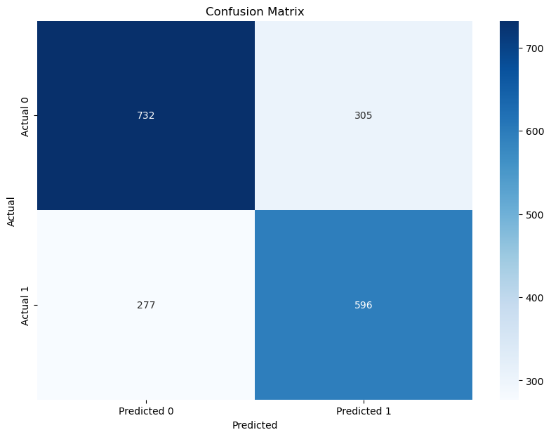

# Math_Learning_Assessment

This project aims to classify students based on their assessment marks using various machine learning techniques. The dataset used in this project is sourced from the UCI Machine Learning Repository.

## Source

- [Dataset for Assessing Mathematics Learning in Higher Education](https://archive.ics.uci.edu/dataset/1031/dataset+for+assessing+mathematics+learning+in+higher+education)

## Dataset


The dataset contains information about students' performance in mathematics, including:
- `Student ID`
- `Student Country`
- `Question ID`
- `Type of Answer`
- `Question Level`
- `Topic`
- `Subtopic`
- `Keywords`
  
The dataset file is included in this repository as [mathE_dataset.csv](mathE_dataset.csv).

## Preprocessing Steps

1. **Loading the Dataset**: The dataset is loaded from a CSV file.
2. **Handling Missing Values**: Mean imputation is applied to numerical columns to handle missing values.
3. **Encoding Categorical Variables**:
   - One-Hot Encoding for categorical variables.
   - Label Encoding for categorical variables.
4. **Scaling Numerical Variables**:
   - Min-Max Scaling.
   - Standard Scaling.
5. **Combining Features**: All encoded and scaled features are combined into a single feature set.
6. **Principal Component Analysis (PCA)**: PCA is applied to reduce the dimensionality of the feature set.

## What is Done

- **Data Preprocessing**: Handling missing values, encoding categorical variables, and scaling numerical variables.
- **Dimensionality Reduction**: Applying PCA to reduce the number of features.
- **Model Training and Evaluation**: Training and evaluating various classifiers on the preprocessed data.
- **Class Balancing**: Using SMOTE to balance the classes in the training set.
- **Stacking Classifier**: Implementing a stacking classifier with Random Forest and KNN as base models and Logistic Regression as the meta-model.

## Solutions

The following classifiers were trained and evaluated:

- Logistic Regression
- Support Vector Machine (SVM)
- K-Nearest Neighbors (KNN)
- Perceptron
- Gaussian Naive Bayes
- Bernoulli Naive Bayes
- AdaBoost
- Gradient Boosting
- Bagging
- Pasting
- Random Forest

## Accuracy of All Classifiers

| Classifier                | Accuracy | F1 Score |
|---------------------------|----------|----------|
| Logistic Regression       | 0.5141   | 0.5148   |
| SVM                       | 0.5581   | 0.5555   |
| KNN                       | 0.6759   | 0.6753   |
| Perceptron                | 0.4613   | 0.4220   |
| Gaussian Naive Bayes      | 0.5288   | 0.5143   |
| Bernoulli Naive Bayes     | 0.5188   | 0.5174   |
| AdaBoost                  | 0.6079   | 0.6086   |
| Gradient Boosting         | 0.6356   | 0.6363   |
| Bagging                   | 0.6885   | 0.6889   |
| Pasting                   | 0.6822   | 0.6823   |
| Random Forest             | 0.6932   | 0.6937   |
| Stacked Model             | 0.6953   | 0.6956   |

## Heatmap of Confusion Matrix



## How to Run

1. Clone the repository:
   ```bash
   git clone https://github.com/yourusername/Math_Learning_Assessment_Project.git
